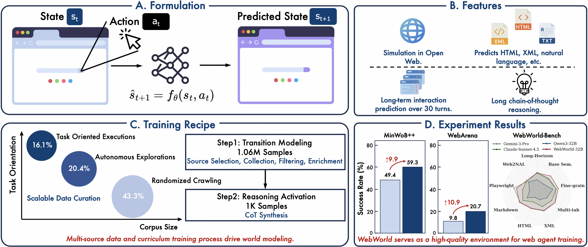
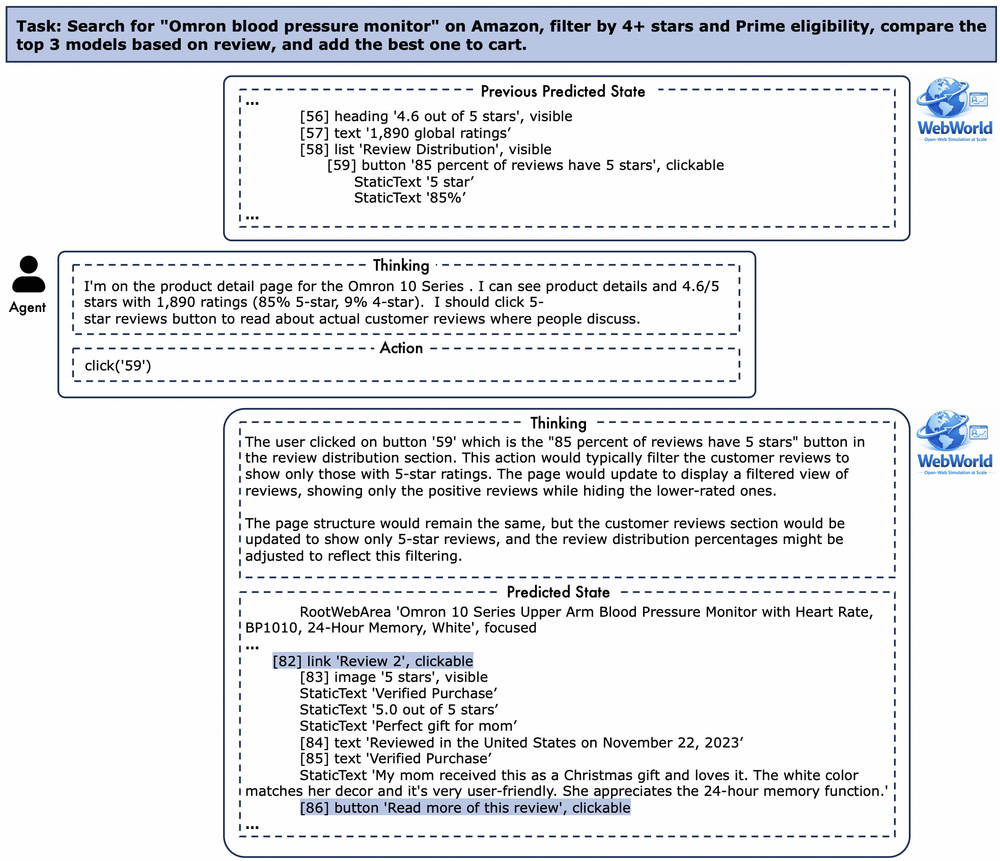

# 基于 SFT 与 GRPO 的多模态网页操作 Agent

This fork packages **QwenLM/WebWorld** as the simulation environment for a
multimodal web-operation Agent training project. The added `mm_webagent`
package aligns the repository with a full Agent workflow:

```text
webpage screenshot + page state + user instruction + action history
    -> GraphRAG retrieves executable task/page/action paths
    -> Qwen-VL policy Agent
    -> click / fill / scroll / goto action
    -> WebWorld simulated feedback or real browser execution
    -> SFT / DPO / PPO / GRPO training data and evaluation metrics
```

## Resume-Oriented Architecture

| Resume requirement | Implementation in this repository |
|---|---|
| Build a multimodal webpage-operation Agent with Qwen3-VL/Qwen2.5-VL | `mm_webagent/agent/` builds policy prompts from screenshot, page state, user instruction, and history. `mm_webagent/data/screenshot_encoder.py` prepares screenshots for VLM backends. |
| Generate click, input, scroll, navigation, and terminal actions | `mm_webagent/data/action_schema.py` defines and validates the unified browser action space. `mm_webagent/agent/action_parser.py` extracts executable actions from model responses. |
| Build web-operation trajectory data | `mm_webagent/data/trajectory_builder.py` converts WebWorld trajectories into SFT records and GRPO rollout seeds. |
| Add GraphRAG retrieval for web-operation experience | `mm_webagent/rag/` implements GraphRAG over task/page/action/outcome/rule/failure nodes, with Qdrant/BGE-M3, BM25/jieba, field BM25, late interaction, and reranking as auxiliary recall signals. |
| Use LoRA for SFT | `mm_webagent/training/sft_train.py` and `mm_webagent/training/lora_config.py` provide the Qwen-VL LoRA SFT entry point and default adapter configuration. |
| Use TRL for SFT, DPO, PPO/RLHF, and GRPO reinforcement learning | `mm_webagent/post_training/` documents and validates SFT/DPO/PPO stages. `mm_webagent/training/grpo_train.py` runs a lightweight reward dry run; `mm_webagent/training/reward.py` implements task-completion, action-validity, step, repetition, and invalid-action rewards. |
| Deploy inference with vLLM | `mm_webagent/serving/vllm_server.py` prints the vLLM launch command; `mm_webagent/serving/client.py` calls an OpenAI-compatible vLLM endpoint. |
| Manage observe, decide, execute, and feedback loops with LangGraph | `mm_webagent/workflow/langgraph_runner.py` implements the loop shape and can be replaced by a concrete LangGraph `StateGraph` when that dependency is installed. |
| Evaluate 20-class tasks with success rate, invalid action rate, average steps, and token usage | `mm_webagent/eval/metrics.py` and `mm_webagent/eval/evaluator.py` provide those metric definitions for saved episodes. WebWorld's original benchmark remains available below. |

## Quickstart For The Agent Scaffold

Build SFT and GRPO seed data from a WebWorld-style trajectory file:

```bash
python -m mm_webagent.data.trajectory_builder \
  --input examples/sample_trajectory.json \
  --sft-output data/mm_webagent/sft_train.jsonl \
  --grpo-output data/mm_webagent/grpo_rollout_seed.jsonl
```

Validate the Qwen-VL LoRA SFT configuration without launching GPU training:

```bash
python -m mm_webagent.training.sft_train \
  --data data/mm_webagent/sft_train.jsonl \
  --model Qwen/Qwen2.5-VL-7B-Instruct \
  --dry-run
```

Run a GRPO reward-shaping dry run:

```bash
python -m mm_webagent.training.grpo_train \
  --rollout-seed data/mm_webagent/grpo_rollout_seed.jsonl
```

Validate DPO preference data and PPO/RLHF rollout rewards:

```bash
python -m mm_webagent.post_training.dpo_train \
  --data examples/sample_preferences.jsonl \
  --model Qwen/Qwen3-0.6B

python -m mm_webagent.post_training.ppo_train \
  --episodes examples/sample_episodes.jsonl \
  --model outputs/sft_lora
```

Compare baseline Hybrid RAG with upgraded Operation Memory Retrieval:

```bash
python -m mm_webagent.eval.retrieval_eval \
  --documents examples/operation_memory_docs.json \
  --queries examples/operation_memory_eval.json \
  --top-k 3
```

Run the GraphRAG demo:

```bash
python examples/run_graphrag_demo.py
```

Print the vLLM serving command:

```bash
python -m mm_webagent.serving.vllm_server \
  --model outputs/sft_lora \
  --served-model-name mm-webagent
```

Run the local Agent workflow demo:

```bash
python examples/run_agent_demo.py
```

Show the project pipeline:

```bash
python -m mm_webagent.cli pipeline
```

See `docs/resume_project_design.md` for the exact mapping between the resume
description and the added modules.
See `docs/hybrid_rag_and_post_training.md` for the Hybrid RAG, SFT, DPO,
PPO/RLHF, GRPO, and vLLM deployment design.
See `docs/retrieval_benchmark_report.md` for the upgraded retrieval benchmark.
See `docs/runtime_strategies_and_graphrag.md` for runtime strategies and the
GraphRAG route.
See `docs/run_and_train.md` for startup, fine-tuning, RLHF, GRPO, and vLLM
deployment commands.

## Upstream WebWorld

The original QwenLM/WebWorld documentation is kept below because this project
uses WebWorld as the world-model simulation and evaluation layer.

[](https://opensource.org/licenses/Apache-2.0)
[](https://arxiv.org/abs/2602.14721)
[](https://huggingface.co/Qwen/WebWorld-8B)
[](https://huggingface.co/Qwen/WebWorld-14B)
[](https://huggingface.co/Qwen/WebWorld-32B)
[](https://huggingface.co/datasets/Qwen/WebWorldData)

<p align="center">
  
</p>

## Introduction

Web agents require massive trajectories to generalize, yet real-world training is constrained by network latency, rate limits, and safety risks. **WebWorld** is the first open-web world model series trained at scale — a large-scale browser simulator that enables agents to train in simulation rather than the real web.

WebWorld features the following:

- **Trained at Scale**: 1M+ real-world web interaction trajectories via a scalable hierarchical data pipeline (100× more than prior work).
- **Long-Horizon Simulation**: Supports multi-turn simulation up to 30+ steps with consistent state tracking.
- **Multi-Format Supporting**: Predicts next states across A11y Tree, HTML, XML, Markdown, and natural language representations.
- **Reasoning**: A two-stage training curriculum injects broad web dynamics first, then activates explicit causal reasoning.

## Models

| Model | Base Model | Parameters | Download |
|---|---|---|---|
| **WebWorld-8B** | Qwen3-8B | 8B | [🤗 HuggingFace](https://huggingface.co/Qwen/WebWorld-8B) |
| **WebWorld-14B** | Qwen3-14B | 14B | [🤗 HuggingFace](https://huggingface.co/Qwen/WebWorld-14B) |
| **WebWorld-32B** | Qwen3-32B | 32B | [🤗 HuggingFace](https://huggingface.co/Qwen/WebWorld-32B) |

**Dataset**: [Qwen/WebWorldData](https://huggingface.co/datasets/Qwen/WebWorldData) — training trajectories, fully open-sourced under Apache 2.0.

## Benchmarks

### Intrinsic Evaluation (WebWorld-Bench)

WebWorld-Bench evaluates models using **Factuality Score** (functional correctness of state transitions) and **Web Turing Score** (perceptual realism via adversarial discrimination) across nine dimensions.

| Model | Avg Factuality | Avg Turing |
|---|---|---|
| GPT-4o | 59.5 | 35.4 |
| Claude-Opus-4.1 | **71.3** | **47.4** |
| Gemini-3-Pro | 70.3 | 43.2 |
| Qwen3-8B (base) | 26.9 | 17.4 |
| **WebWorld-8B** | **70.1** | **42.2** |
| **WebWorld-14B** | 70.7 | 44.7 |
| **WebWorld-32B** | **71.0** | **45.6** |

### Extrinsic Evaluation (Agent Training)

Agents fine-tuned on WebWorld-synthesized trajectories:

| Model | MiniWob++ SR | WebArena SR |
|---|---|---|
| GPT-4o | 64.3% | 26.6% |
| Qwen3-8B (base) | 49.4% | 9.8% |
| **Qwen3-8B + WebWorld** | **59.3%** (+9.9%) | **20.7%** (+10.9%) |
| Qwen3-14B (base) | 54.9% | 15.1% |
| **Qwen3-14B + WebWorld** | **63.2%** (+8.3%) | **24.3%** (+9.2%) |

### Cross-Domain Generalization

| Environment | Qwen3-8B | WebWorld-8B | Gain |
|---|---|---|---|
| API Services | 0.088 | **0.299** | +0.211 |
| Code | 0.147 | **0.396** | +0.249 |
| Game | 0.253 | **0.473** | +0.220 |
| GUI Desktop | 0.322 | **0.705** | +0.383 |

For detailed results, please check out the [paper](https://arxiv.org/pdf/2602.14721).

## Quickstart

<p align="center">
  
</p>

### 1. Installation

```bash
pip install -r requirements.txt
tar -xzf data.tar.gz
```

### 2. Model Configuration

All model calls go through `core/serve/unified_api.py`. To add a new model provider, create a file (e.g., `core/serve/oai.py`) and register it in `unified_api.py`. Then specify your model in `config/model_config.yaml` for the WebWorld-Bench or in `demo/config.py` for the demo.

### 3. Run Demo (Interaction between Agent and WebWorld)

The demo showcases an agent interacting with WebWorld. Given a user query, you can observe the step-by-step trajectory of the agent navigating and operating within the web environment. Running the demo will generate HTML trajectory files that can be opened in a browser for visualization. Some samples are provided in `demo/demo.zip`.

```bash
python ./demo/demo.py
```

## Inference

### Single-Step Prediction

<details>
<summary>💻 Click to expand code</summary>

```python
import torch
from transformers import AutoTokenizer, AutoModelForCausalLM

model_name = "Qwen/WebWorld-8B"  # or WebWorld-14B, WebWorld-32B
tokenizer = AutoTokenizer.from_pretrained(model_name, trust_remote_code=True)
model = AutoModelForCausalLM.from_pretrained(
    model_name,
    device_map="auto",
    torch_dtype=torch.bfloat16,
    trust_remote_code=True,
).eval()

system_prompt = (
    "You are a web world model. I will provide you with an initial page state "
    "and a sequence of actions. For each action, predict the resulting page state.\n"
    "Strictly maintain the original format. Output only the full page state "
    "without explanations, code, or truncation."
)

current_state = """RootWebArea 'Global Start - Your Daily Portal', focused
\t[1] banner 'Top Header', visible
\t\t[2] link 'Set as Homepage', clickable, visible
\t\t[3] link 'Feedback', clickable, visible
\t\t[5] region 'Weather Widget', visible
\t\t\tStaticText 'New York, USA'
\t\t\t[6] image 'Sunny', visible
\t\t\tStaticText '24°C'
\t\t[8] link 'Sign In', clickable, visible
\t[10] region 'Search Area', visible
\t\t[11] image 'Global Start Logo', visible
\t\tStaticText 'Search the entire web'
\t\t[12] tablist 'Search Engine Selector', orientation='horizontal'
\t\t\t[13] tab 'Google', selected=True, clickable
\t\t\t[14] tab 'Bing', selected=False, clickable
\t\t\t[15] tab 'DuckDuckGo', selected=False, clickable
\t\t[18] combobox 'Web Search', clickable, visible, autocomplete='both', expanded=False
\t\t\t[19] textbox 'Type keywords or URL...', clickable, visible, editable, value=''
\t\t[20] button 'Search', clickable, visible
\t[30] navigation 'Category Bar', visible
\t\t[31] link 'Home', clickable, selected=True
\t\t[32] link 'News', clickable
\t\t[33] link 'Video', clickable
\t\t[34] link 'Shopping', clickable
\t\t[35] link 'Social', clickable
\t[50] main 'Site Directory', visible
\t\t[51] region 'Top Recommended', visible
\t\t\t[52] heading 'Most Popular', visible
\t\t\t[53] list 'Top Sites Grid', visible
\t\t\t\t[54] link 'Facebook', clickable
\t\t\t\t[56] link 'YouTube', clickable
\t\t\t\t[58] link 'Amazon', clickable
\t\t\t\t[60] link 'Twitter / X', clickable
\t\t\t\t[62] link 'Instagram', clickable
\t\t\t\t[64] link 'Wikipedia', clickable
\t\t\t\t[66] link 'Netflix', clickable
\t\t\t\t[68] link 'LinkedIn', clickable
\t\t[80] region 'News & Media', visible
\t\t\t[81] heading 'Latest News', visible
\t\t\t[82] link 'CNN', clickable
\t\t\t[83] link 'BBC', clickable
\t\t\t[84] link 'The Verge', clickable
\t\t[90] region 'Shopping', visible
\t\t\t[91] heading 'E-Commerce', visible
\t\t\t[92] link 'eBay', clickable
\t\t\t[93] link 'Walmart', clickable
\t\t\t[94] link 'Best Buy', clickable
\t[200] complementary 'Ads', visible
\t\t[201] image 'Ad: Travel to Japan'
\t\t[202] link 'Book Now', clickable
\t[300] contentinfo 'Footer', visible
\t\tStaticText '© 2026 Global Start Inc.'"""

user_message = (
    f"Initial Page State:\n{current_state}\n\n"
    f"First Action: 'click([32])'\n\n"
    f"Next Page State:"
)

messages = [
    {"role": "system", "content": system_prompt},
    {"role": "user", "content": user_message},
]

text = tokenizer.apply_chat_template(messages, tokenize=False, add_generation_prompt=True)
inputs = tokenizer(text, return_tensors="pt").to(model.device)

with torch.no_grad():
    outputs = model.generate(
        **inputs,
        max_new_tokens=4096,
        do_sample=False,
    )

response = tokenizer.decode(
    outputs[0][inputs["input_ids"].shape[-1]:],
    skip_special_tokens=True
)
print(response)
```

</details>

### Multi-Turn Simulation

The first turn provides the initial state and first action. Each subsequent turn uses a fixed continuation prompt:

<details>
<summary>💻 Click to expand code</summary>

```python
CONTINUE_PROMPT = (
    "Continue the trajectory. Given the previous state, "
    "predict the next page state after this action.\n\n"
    "Action: '{action}'\n\nNext Page State:"
)

# Turn 1
messages = [
    {"role": "system", "content": system_prompt},
    {"role": "user", "content": f"Initial Page State:\n{state_0}\n\nFirst Action: '{action_0}'\n\nNext Page State:"},
]
state_1 = generate(messages)  # your generate function

# Turn 2
messages.append({"role": "assistant", "content": state_1})
messages.append({"role": "user", "content": CONTINUE_PROMPT.format(action=action_1)})
state_2 = generate(messages)

# Turn 3, 4, ... up to 30+ turns: repeat the same pattern
messages.append({"role": "assistant", "content": state_2})
messages.append({"role": "user", "content": CONTINUE_PROMPT.format(action=action_2)})
state_3 = generate(messages)
```

</details>

## Action Space

WebWorld supports a unified action space as Python-style function calls:

| Category | Action | Description |
|---|---|---|
| **Element** | `click(bid, button, modifiers)` | Click a DOM element by its ID |
| | `fill(bid, text, press_enter)` | Type text into an input field |
| | `select_option(bid, options)` | Select from a dropdown / combobox |
| | `hover(bid)` | Hover over an element |
| **Mouse** | `mouse_move(x, y)` | Move cursor to coordinates |
| | `mouse_click(x, y, button)` | Click at coordinates |
| | `mouse_down(x, y)` / `mouse_up(x, y)` | Press / release (drag-and-drop) |
| **Keyboard** | `keyboard_press(key)` | Press a key (e.g., `Enter`, `Tab`) |
| | `keyboard_type(text)` | Type a string sequentially |
| **Browser** | `scroll(dx, dy)` | Scroll the viewport |
| | `goto(url)` | Navigate to a URL |
| | `go_back()` / `go_forward()` | Browser history navigation |
| | `tab_new()` / `tab_close()` / `tab_focus(index)` | Manage browser tabs |
| **Meta** | `send_msg_to_user(text)` | Send a message to the user |
| | `noop(wait_ms)` | Wait for a duration |
| | `infeasible(reason)` | Declare the task impossible |


## WebWorld-Bench

### Run Benchmark

```bash
python main.py
```

## License

All models and data are licensed under [Apache 2.0](https://www.apache.org/licenses/LICENSE-2.0).

## Citation

```bibtex
@misc{xiao2026webworldlargescaleworldmodel,
      title={WebWorld: A Large-Scale World Model for Web Agent Training}, 
      author={Zikai Xiao and Jianhong Tu and Chuhang Zou and Yuxin Zuo and Zhi Li and Peng Wang and Bowen Yu and Fei Huang and Junyang Lin and Zuozhu Liu},
      year={2026},
      eprint={2602.14721},
      archivePrefix={arXiv},
      primaryClass={cs.AI},
      url={https://arxiv.org/abs/2602.14721}, 
}
```
